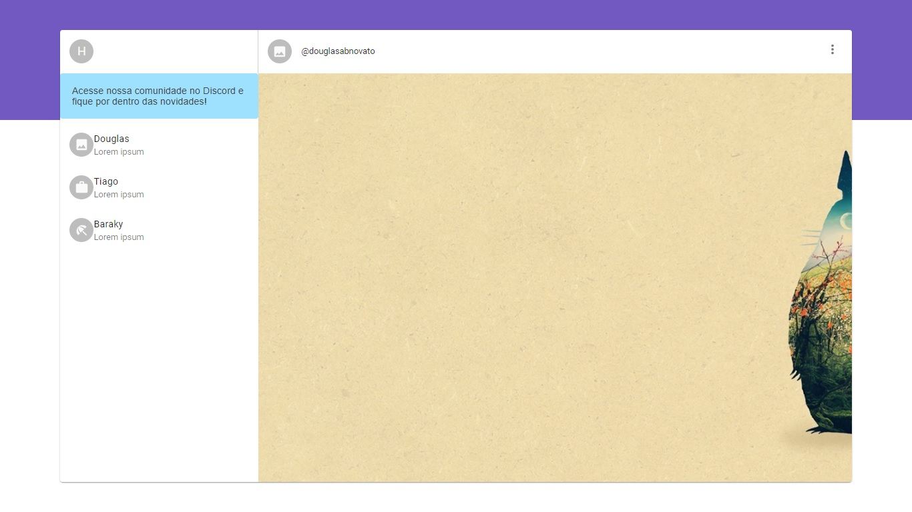

<h1 align="center">
    
</h1>

<h4 align="center"> 
	🚧 Whatsapp Web 🚀 em construção... 🚧
</h4> 

<p align="center">
  
  
  <a href="https://www.twitter.com/douglasabnovato/">
    
  </a>
</p>

## 💻 Sobre o projeto

♻️ whatsapp web

Design inspirado no whatsapp web.
 
## 🎨 Layout

### Layout do Whatsapp Web em ReactJS com Material UI 

- Whatsapp Web utilizando material-ui, uma biblioteca visual para ReactJS.
- Integração do Material UI com ReactJS
- instalar o Material UI: `npm install @material-ui/core`
- adicionar os componentes ícones: `npm install @material-ui/icons`
- adicionaremos os links das fonts Roboto e Fonts Icon
- `<link rel="stylesheet" href="https://fonts.googleapis.com/css?family=Roboto:300,400,500">`
- `<link rel="stylesheet" href="https://fonts.googleapis.com/icon?family=Material+Icons">`
- fundo acinzentado no body, no index.css
````js
body {
    margin: 0;
    padding: 0;
    font-family: sans-serif;
    background: "#dfdfdf";
}
````
- função withStyles
- injetamos um CSS customizado
- Fonts Icon:`@material-ui/icons` - ícones que queremos
- componentes estilizados e padronizados do Material UI
- `@material-ui/core` - ícones que queremos

### Web - v1.0

<p align="center" style="display: flex; align-items: flex-start; justify-content: center;">
  
</p> 

## 🛠 Tecnologias

As seguintes ferramentas foram usadas na construção do projeto:

- [Css][css]: posicionamento, dimensionamento e muito mais
- [Javascript][javascript]
- [HTML][html]: estrutura e efeitos 
- [React][reactjs]: os fundamentos, como state, props, components, ciclo de vida.
- [Git][git]
- [Github][github] 
- [Yarn][yarn]
- [Node.js][nodejs]
- [Zeit Now](https://vercel.com/)

## 🚀 Como executar o projeto

Podemos considerar este projeto como sendo com uma parte:
1. Front End  

### Pré-requisitos

Antes de começar, você vai precisar ter instalado em sua máquina as seguintes ferramentas:
[Git](https://git-scm.com), [Node.js][nodejs]. 
Além disto é bom ter um editor para trabalhar com o código como [VSCode][vscode]

### 🧭 Rodando a aplicação web (Front End)

```bash 
# Clone este repositório
$ git clone https://github.com/douglasabnovato/whatsapp-web

# Acesse a pasta do projeto no seu terminal/cmd
$ cd whatsapp-web 

# Instale as dependências
$ npm install

# Execute a aplicação em modo de desenvolvimento
$ npm run start

# A aplicação será aberta na porta:3000 - acesse http://localhost:3000

```

## 😯 Como contribuir para o projeto

1. Faça um **fork** do projeto.
2. Crie uma nova branch com as suas alterações: `git checkout -b my-feature`
3. Salve as alterações e crie uma mensagem de commit contando o que você fez: `git commit -m "feature: My new feature"`
4. Envie as suas alterações: `git push origin my-feature`
> Caso tenha alguma dúvida confira este [guia de como contribuir no GitHub](https://github.com/firstcontributions/first-contributions)


## 📝 Licença

Este projeto esta sobe a licença MIT.

Feito com ❤️ por Douglas A B Novato 👋🏽 [Entre em contato!](https://www.linkedin.com/in/douglasabnovato/)

[git]: https://git-scm.com/doc
[github]: https://docs.github.com/en
[nodejs]: https://nodejs.org/
[typescript]: https://www.typescriptlang.org/
[expo]: https://expo.io/
[reactjs]: https://reactjs.org
[rn]: https://facebook.github.io/react-native/
[yarn]: https://yarnpkg.com/
[vscode]: https://code.visualstudio.com/
[vceditconfig]: https://marketplace.visualstudio.com/items?itemName=EditorConfig.EditorConfig
[license]: https://opensource.org/licenses/MIT
[vceslint]: https://marketplace.visualstudio.com/items?itemName=dbaeumer.vscode-eslint
[prettier]: https://marketplace.visualstudio.com/items?itemName=esbenp.prettier-vscode
[rs]: https://rocketseat.com.br 
[css]: https://developer.mozilla.org/en-US/docs/Web/CSS 
[html]: https://developer.mozilla.org/en-US/docs/Web/HTML
[javascript]: https://developer.mozilla.org/en-US/docs/Web/JavaScript 

Fonte - [React: criando um site para empresas - Reginaldo Santos](https://www.youtube.com/watch?v=3I9xv-t42Q4)
 


:. De [Blog Rocketseat - Integração do Material UI com ReactJS - Higo Ribeiro](https://blog.rocketseat.com.br/react-material-ui/)